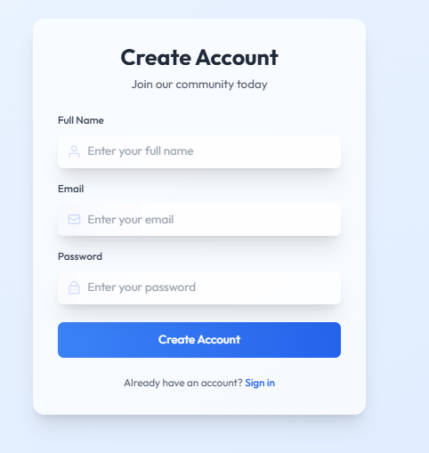
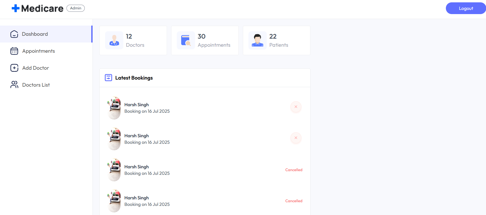
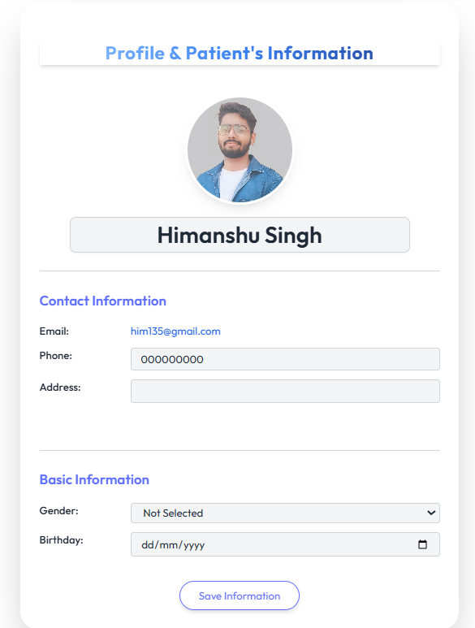
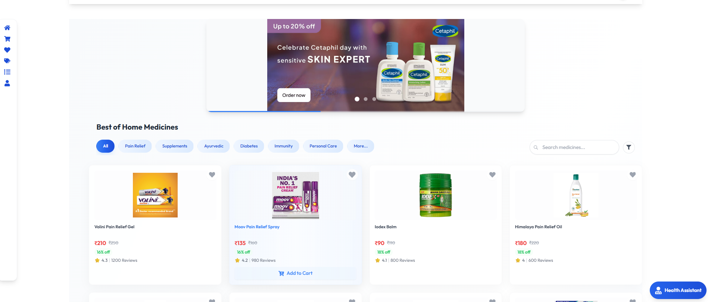
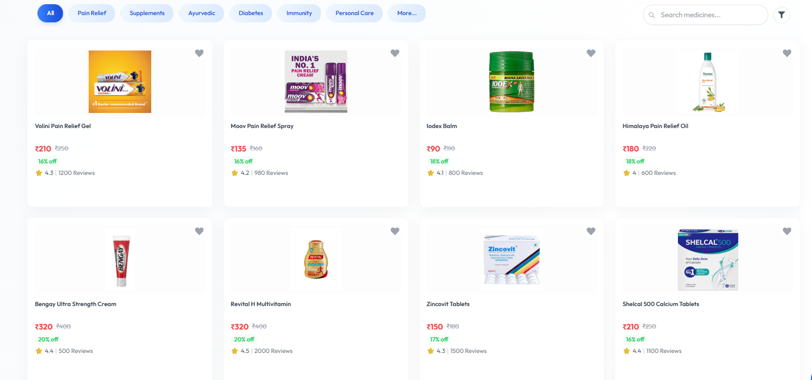
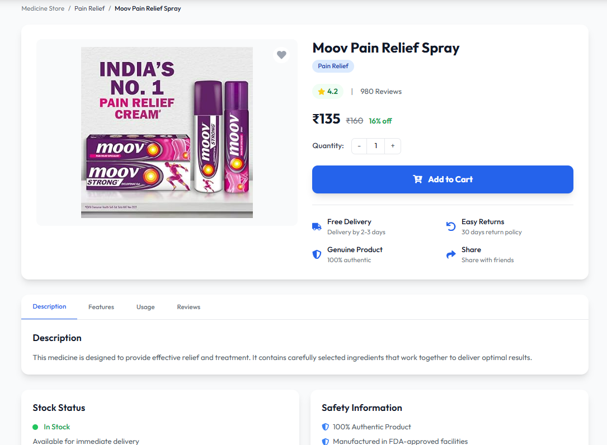

# 🏥 Medicare Project

<div align="center">
  
  
  [](https://reactjs.org/)
  [](https://nodejs.org/)
  [](https://www.mongodb.com/)
  [](https://tailwindcss.com/)
</div>

## 📋 Overview

Medicare is a comprehensive healthcare management system that integrates patient care, medical store management, and administrative functions. The platform provides a seamless experience for patients, healthcare providers, and administrators.

## 🎯 Key Features

### 👥 User Features
- **Patient Portal**
  - Easy appointment scheduling
  - Medical history access
  - Prescription management
  - Online consultation booking
  - Health records tracking

### 🏪 MediStore Features
- **E-commerce Platform**
  - Wide range of medical products
  - Category-wise browsing
  - Secure payment gateway
  - Order tracking
  - Prescription-based purchases

### 👨‍⚕️ Healthcare Provider Features
- **Doctor Dashboard**
  - Patient management
  - Appointment scheduling
  - Medical records access
  - Prescription generation
  - Consultation history

### 👨‍💼 Admin Features
- **Administrative Control**
  - User management
  - Inventory control
  - Sales analytics
  - System configuration
  - Report generation

## 🛠️ Technology Stack

### Frontend
- **React.js** with Vite for fast development
- **Tailwind CSS** for modern, responsive design
- **Framer Motion** for smooth animations
- **React Hot Toast** for user notifications
- **Redux** for state management

### Backend
- **Node.js** runtime environment
- **Express.js** web framework
- **MongoDB** database
- **JWT** for authentication
- **Mongoose** for database modeling

### Admin Panel
- **React.js** with Vite
- **Tailwind CSS**
- **Material-UI** components
- **Chart.js** for analytics

## 🚀 Getting Started

### Prerequisites
- Node.js (v14 or higher)
- npm or yarn
- MongoDB
- Git

### Installation

1. **Clone the repository**
```bash
git clone https://github.com/Himanshu250625/Medicare_New.git
cd Medicare_New
```

2. **Install dependencies**
```bash
# Install root dependencies
npm install

# Install frontend dependencies
cd frontend
npm install

# Install backend dependencies
cd ../backend
npm install

# Install admin panel dependencies
cd ../admin
npm install
```

3. **Environment Setup**
```bash
# Backend (.env)
MONGODB_URI=your_mongodb_uri
JWT_SECRET=your_jwt_secret
PORT=5000

# Frontend (.env)
VITE_API_URL=http://localhost:5000
```

### Running the Application

1. **Start the backend server**
```bash
cd backend
npm start
```

2. **Start the frontend development server**
```bash
cd frontend
npm run dev
```

3. **Start the admin panel**
```bash
cd admin
npm run dev
```

## 📸 Screenshots

### Frontend

*Main landing page of the application*


*User authentication page*


*User dashboard with key features*


*Easy-to-use appointment scheduling interface with calendar view*

### Admin Panel

*Administrative control panel*


*User management interface*

### MediStore

*MediStore main page with featured products*


*Browse products by categories*


*Detailed view of medical products*


*Shopping cart and checkout interface*

## 🔒 Security Features
- JWT-based authentication
- Password encryption
- Role-based access control
- Secure payment processing
- Data encryption at rest

## 📱 Mobile Responsiveness
- Fully responsive design
- Mobile-first approach
- Cross-browser compatibility
- Touch-friendly interface

## 🤝 Contributing

1. Fork the repository
2. Create your feature branch (`git checkout -b feature/AmazingFeature`)
3. Commit your changes (`git commit -m 'Add some AmazingFeature'`)
4. Push to the branch (`git push origin feature/AmazingFeature`)
5. Open a Pull Request

## 📄 License

This project is licensed under the MIT License - see the [LICENSE](LICENSE) file for details.

## 👨‍💻 Contact

Himanshu Singh - [him979322@gmail.com](mailto:him979322@gmail.com)

Project Link: [https://github.com/Himanshu250625/Medicare_New](https://github.com/Himanshu250625/Medicare_New)

## 🙏 Acknowledgments
- Thanks to all contributors
- Special thanks to the open-source community
- Inspired by modern healthcare solutions 