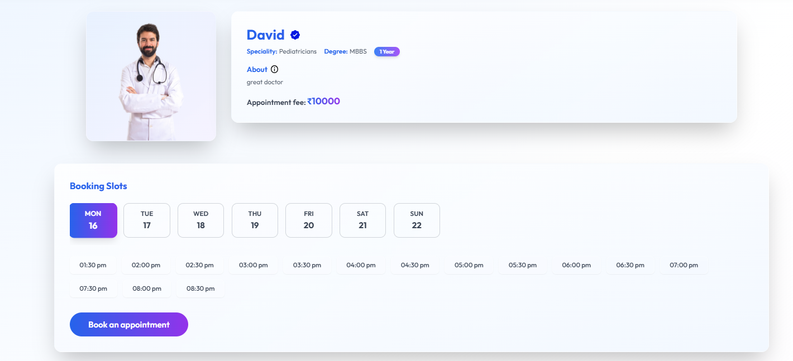

# Medicare Project

A comprehensive healthcare management system with separate frontend, backend, and admin interfaces.

## Project Structure

The project is divided into three main components:

- `frontend/` - User-facing web application
- `backend/` - Server and API implementation
- `admin/` - Administrative dashboard

## Technology Stack

### Frontend
- React.js with Vite
- Tailwind CSS for styling
- Framer Motion for animations
- React Hot Toast for notifications

### Backend
- Node.js
- Express.js
- MongoDB (based on the project structure)

### Admin Panel
- React.js with Vite
- Tailwind CSS
- Modern UI components

## Getting Started

### Prerequisites
- Node.js (v14 or higher)
- npm or yarn
- MongoDB

### Installation

1. Clone the repository:
```bash
git clone [your-repository-url]
cd Medicare_New
```

2. Install dependencies for all components:

```bash
# Install root dependencies
npm install

# Install frontend dependencies
cd frontend
npm install

# Install backend dependencies
cd ../backend
npm install

# Install admin panel dependencies
cd ../admin
npm install
```

### Running the Application

1. Start the backend server:
```bash
cd backend
npm start
```

2. Start the frontend development server:
```bash
cd frontend
npm run dev
```

3. Start the admin panel:
```bash
cd admin
npm run dev
```

## Features

- User authentication and authorization
- Patient management
- Appointment scheduling
- Medical records management
- Admin dashboard for system management
- Responsive design for all interfaces

## Screenshots

### Frontend

*Main landing page of the application*


*User authentication page*


*User dashboard with key features*


*Easy-to-use appointment scheduling interface with calendar view*

### Admin Panel

*Administrative control panel*


*User management interface*

### MediStore

*MediStore main page with featured products*


*Browse products by categories*


*Detailed view of medical products*


*Shopping cart and checkout interface*

## Contributing

1. Fork the repository
2. Create your feature branch (`git checkout -b feature/AmazingFeature`)
3. Commit your changes (`git commit -m 'Add some AmazingFeature'`)
4. Push to the branch (`git push origin feature/AmazingFeature`)
5. Open a Pull Request

## License

This project is licensed under the MIT License - see the LICENSE file for details.

## Contact

Your Name - [your-email@example.com]

Project Link: [https://github.com/yourusername/Medicare_New](https://github.com/yourusername/Medicare_New) 